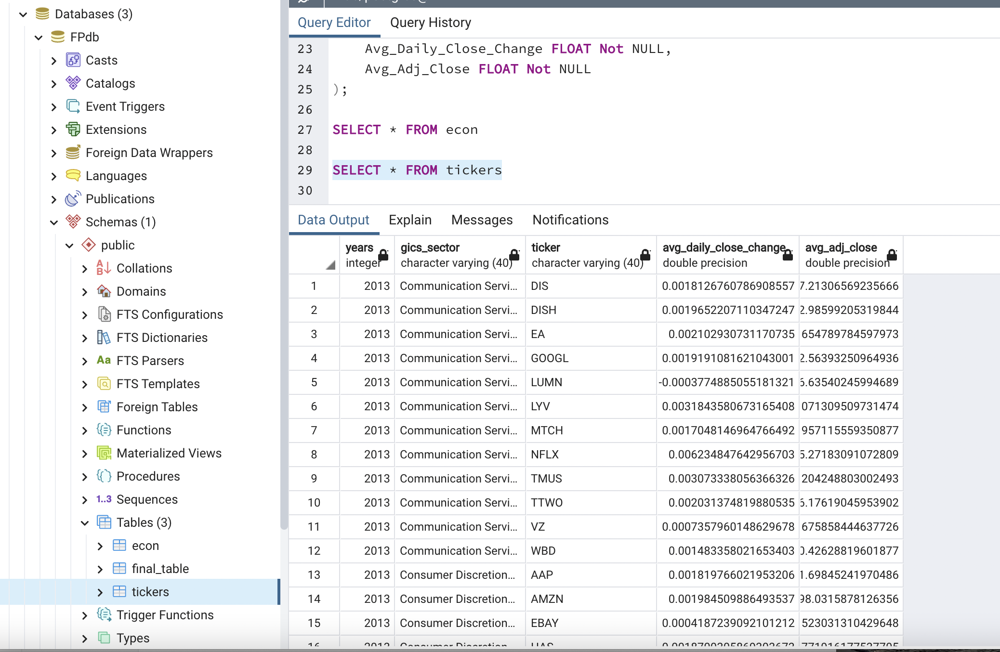
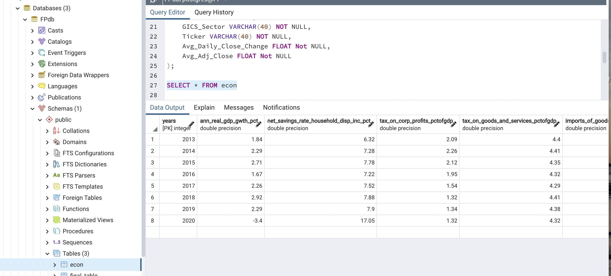
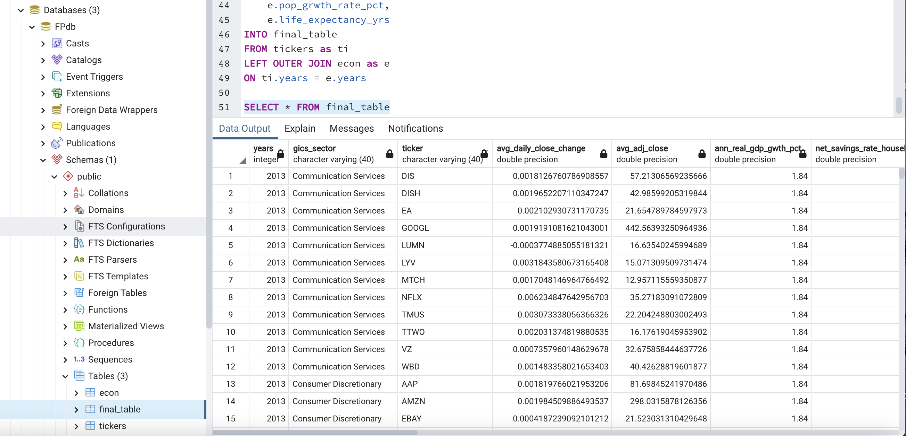
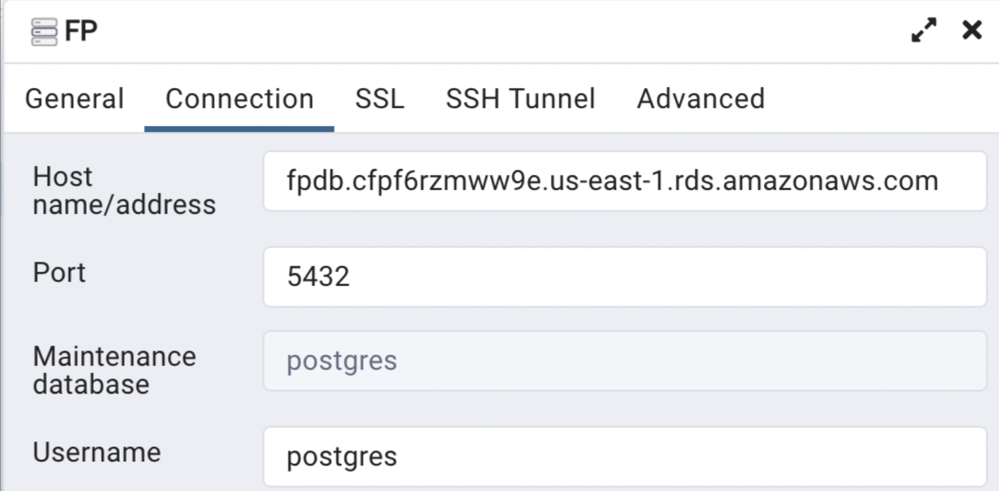

# Database Creation and Integration 
The Database was created in Postgres and was connected to an AWS database to ensure other team members would be able to access the database and use the table from the database in the ML model. 

## Creating Tables 
I created two tables, one for the Ticker data and one for the Econ data. To see how the tables were created please refer to the [schema](schema.sql) file. 

## Uploading Data
I then imported the ticker csv and econ csv from the Final ETL process into the Postgres DB tables, as shown below. 

Ticker Table:

Econ Table:

## Merging the Tables 

Referencing the ERD, I merged the ticker table and the econ table using a left outer join by Year so that for each ticker for each year the econ data would be in the same row. The merged tables were put into a new table called final_table. The final_table is to be used in the ML model, which will be accessed through the AWS endpoint. 

ERD found here: 
[ERD](https://github.com/AlexGeiger1/Final_Project/blob/Database/Data/ERD%20-%20Final%20Project.PNG)

For more information on how the tables were merged, please refer to the following file:

[schema](schema.sql) 

Below is an image of the final table:

## AWS Connection
Below is an image of the AWS Connection for reference. 
