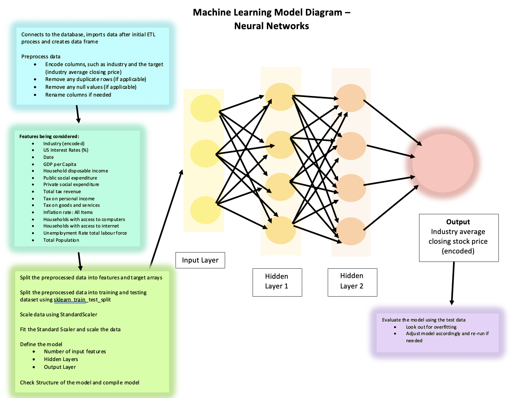

# Machine Learning Model - Mockup 

We chose to use the neural network model as we believe it will be the best model for time-series forecasting and also works well with complex and numerous features.

To take in data from the database, the model will read a CSV file that is exported from the database.

We plan to encode the "Industry" feature as it is currently string data. We also plan to encode our output (the stock's closing price).

We will also use sklearn `StandardScaler` to scale the features.

We will be training our model using sklearn’s `train_test_split`

While train-to-test percentages will be better determined once we clean our datasets, we are initially thinking a 80% train and 20% test split.

Please see below a mockup of our machine learning model. 

